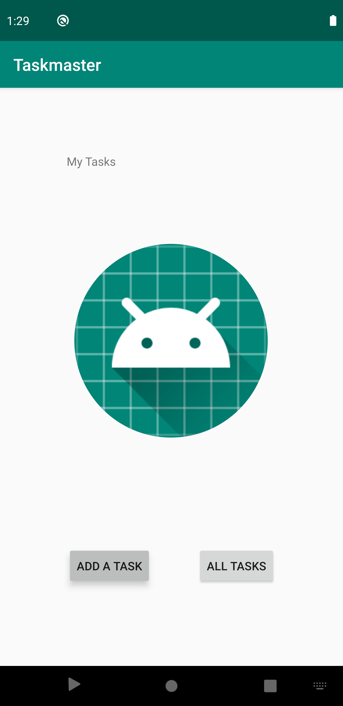
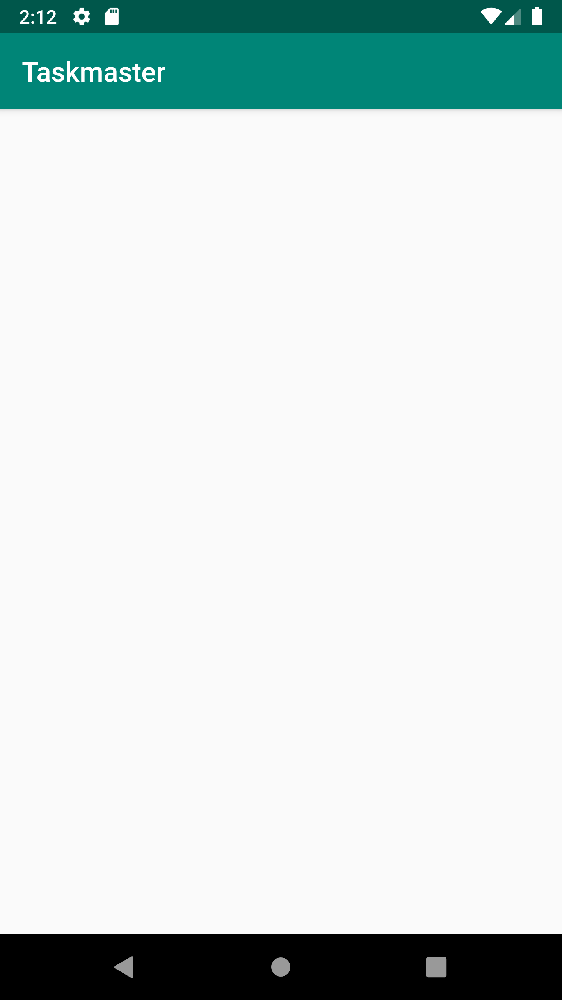
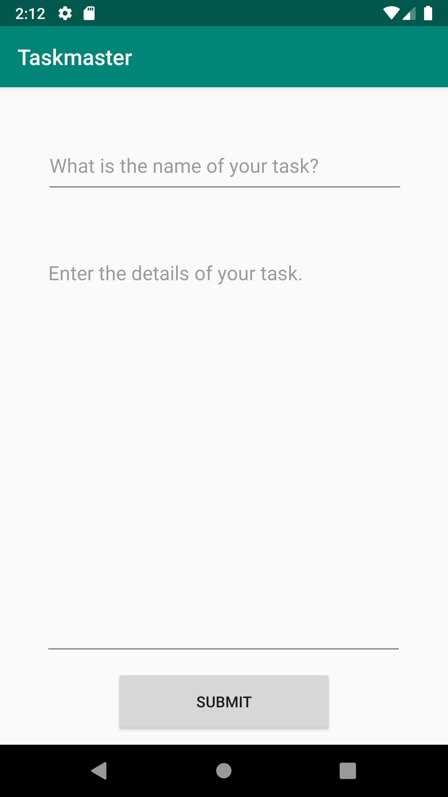
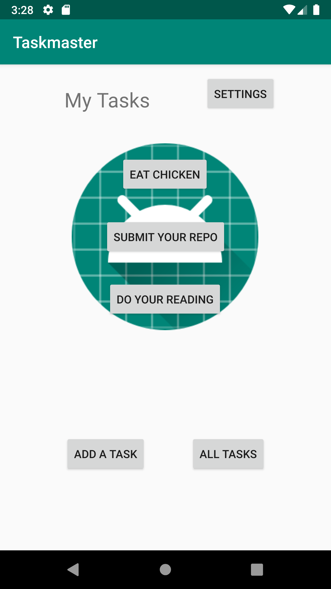
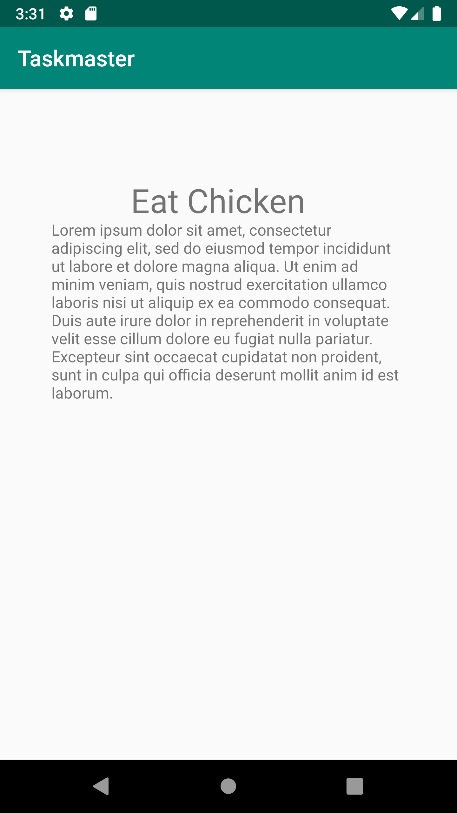
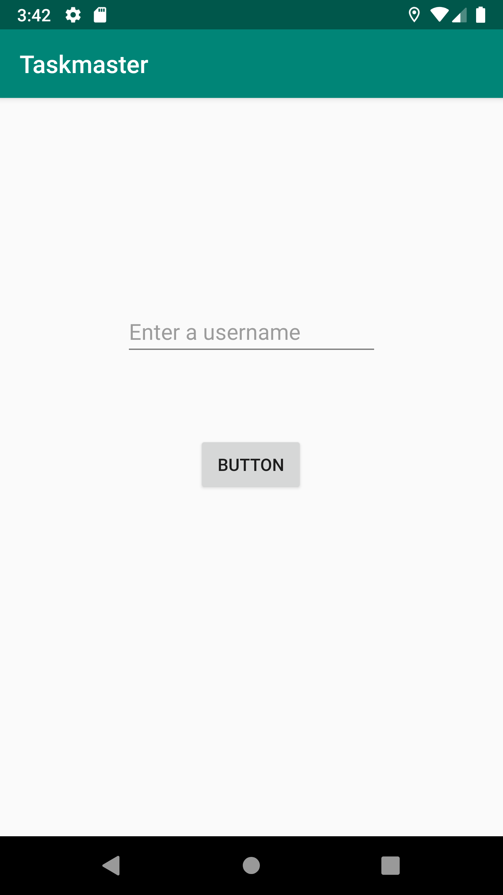

##TaskMaster
*  ## Day 1
    * ### Added home screen that has two buttons a placeholder image and a title
        
    * ### Added an AllTasks page
        
    * ### Added an AddTasks page that has 2 text areas
        

*   ## Day 2
    * ### Added 4 buttons to the home screen that link to a Settings page and three tasks to choose from
        * All tasks are relient on a method that gets the button text and passes it to DetailsPage using a Labeled Intent
        
    * ### Changed title on the Disriptin page
        * change happens in accordance with the name of the button clicked as mentioned earlier
        
    * ### Added Settings page that allows you to input a username
        * on submit a toast is shown and you are taken back to the home page.
        
